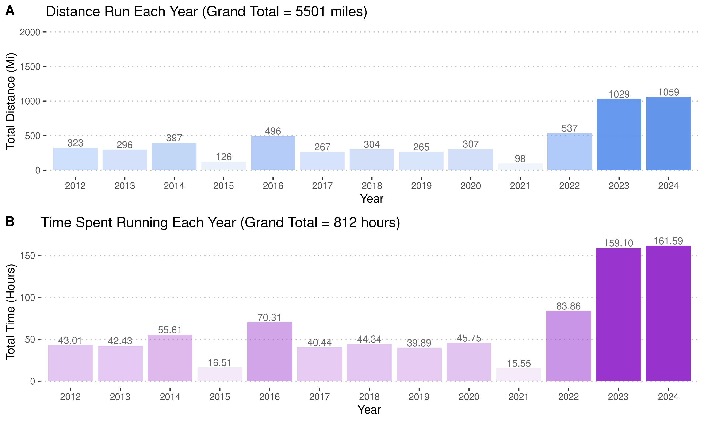
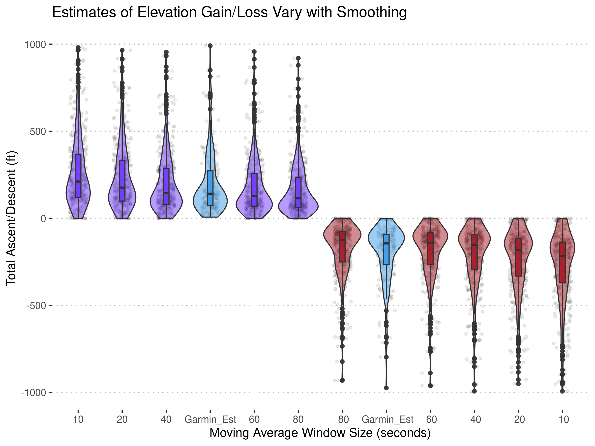
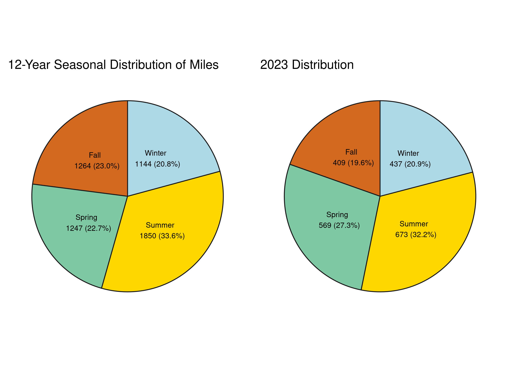

# garmin_wrapped

## Overview

**Are you a data nerd or enthusiast looking to dive into your fitness analytics, but want to dive deeper than Garmin Connect or Strava allows?** Maybe you're dreaming up the next new running metric and want to pilot it on some of your previous runs. Or, maybe you just want to condense this data into a few nice figures-- Spotify Wrapped style. 

 

I've written some scripts that replicate figures similar to those in Connect, as well as a script to **plot paths in a manner similar to Strava** (Premium) heatmaps. 

 

You can also add your own metrics/plots and even play around with per-second data only accessible at the `.fit` level. **For example, I wanted to test the effect of a few different smoothing windows on elevation gain/loss** (Total Ascent/Descent) metrics, and see how the distributions of these estimates compare with Garmin's own (likely more sophisticated) estimate. It appears a 40s smoothing window gets me pretty close to Garmin's estimate...but too small of a window and barometer noise can vastly overpredict ascent/descent on some runs.

 

After determining a reasonable smoothing window (40s seems to match Garmin's estimate reasonably well), I looked at the relative hilliness of my runs in the three states I've trained the most in to make sure I'm getting enough hilly runs in Indiana (it appears that I might not be!)

On top of looking at how this year's runs compare to all 1000+ runs I've completed, I also wanted to see how my **training by season** this year compared to all my runs. Seems like having COVID in Feb put me at a slight winter distance deficit!!

---

## Getting and Preparing Your Data from Garmin

At the time of writing this, Garmin allows you FULL access to your data and metrics. To run my code, you just need to get all of your activity-related `.fit` or `.txt` files ever recorded (over 40,000 over 12 years from 6 devices in my case!) into a single folder. It's a little annoying in that Garmin doesn't save these files with any decipherable filename you can use to separate runs from other activities and daily health metrics. So...the code needs to parse through all of those files. 

You can request all your data from Garmin [here](https://www.garmin.com/en-US/account/datamanagement/) under '**Export Your Data**'. They will email you a massive compressed file with everything they have on you. 

Download that file, extract the folders from it, and navigate to `/DI_CONNECT/DI-Connect-Uploaded-Files/` . There will be some more compressed folders starting with `UploadedFiles...`. Extract all of them, and merge the contents of all three folders into a separate folder. This is a lot of files, so you're encouraged to use `mv` or `cp` in the terminal if it takes your computer a long time to load them all. 

Know the address of your new folder with all `.fit` or `.txt` files, it will be important in the next step.

---

## Using the code

If you can handle some basic R programming (Python in the works!), this repository hopefully should get you started (pardoning a bit of inefficient coding on my part, this is my first R project). After getting all your `.fit` files into a single folder, I recommend doing things in this order. 

1. Install R Studio

2. Open  `convert_and_parse_Fit.R`. This script will parse and batch convert your `.fit` and `.txt` files to `.csv` files that are easier to work with. To run this script, you will need to install the `FITfileR` and `trackeR` packages. Be sure to install any missing packages that are needed to complete that installation. The commented code in this script should help.

3. Edit `data_dir`, `out_dir`, and `meta_dir` to match the folder structure on your compure. `data_dir` is where your fit files are, `out_dir` is where you want your converted `.csv`s to go, and `meta_dir` is where you want your per-run summary table of all runs to go.

4. Run `convert_and_parse_Fit.R` . Don't be alarmed if most of the files print an error as you're parsing through. Most of those files are likely not running activities. It may take a while to run (~~2 hours for 40k fit files). Just make sure you eventually start seeing some `.csv` files in your `out_dir`. 

5. Then, play around with either the summary data, or individual run data as you'd like. I have a few example scripts in `/Analysis/R/` that might help get you started.

---

## Acknowledgements

Because I want this to be generally free to use, I recommend Leaflet (free) for overlaying paths on a map over any package using Google Maps API (paid). Additionally, the creators of `FITfileR`, and `trackeR` deserve a lot of credit for putting  together `.fit` and `.txt`parsers so I didn't have to write my own. 
